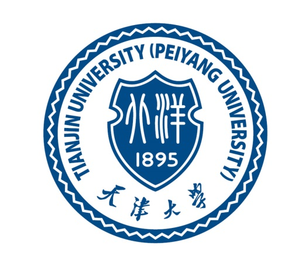
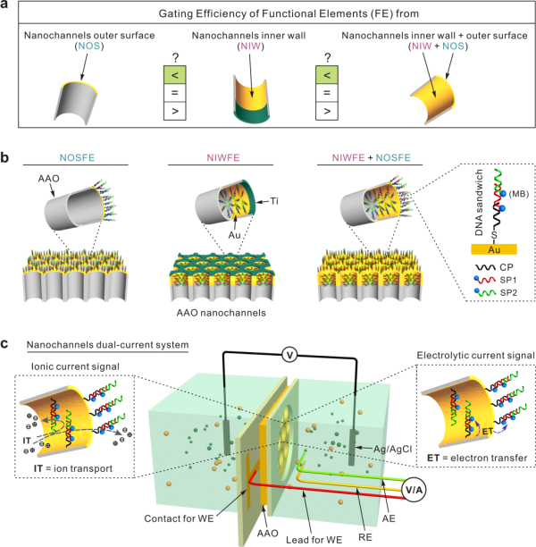
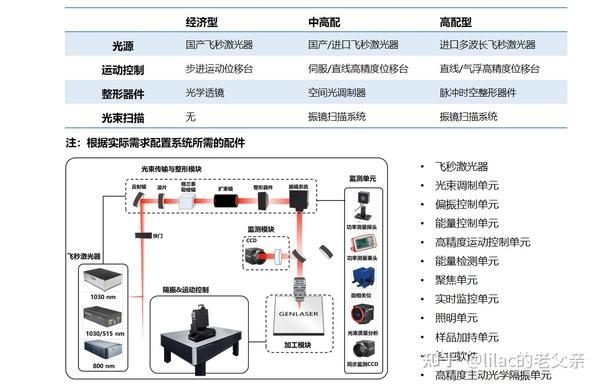
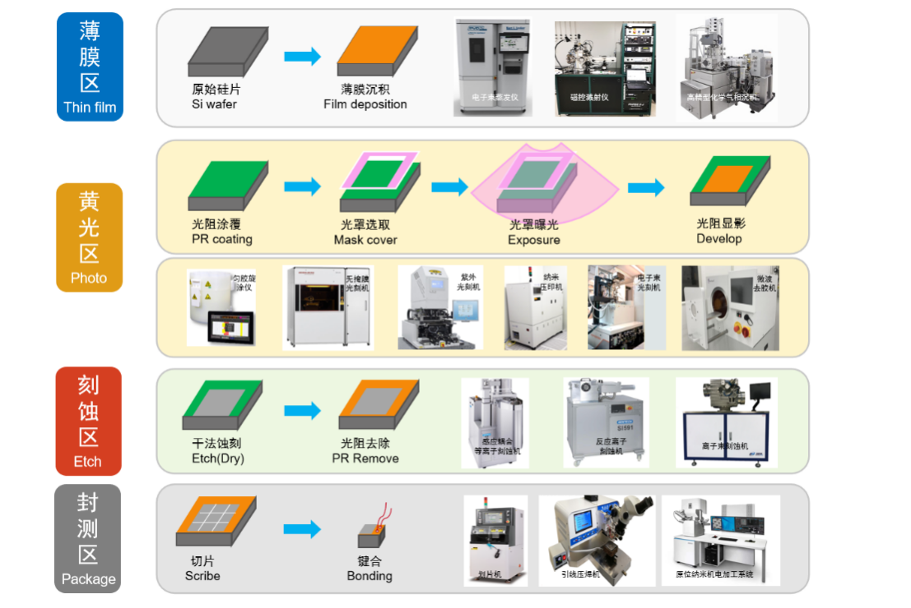
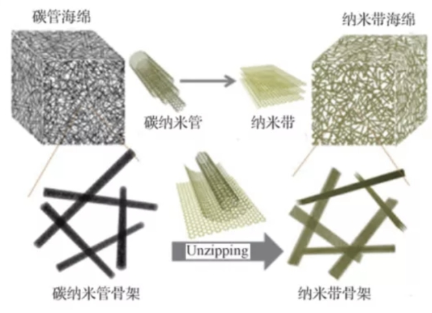
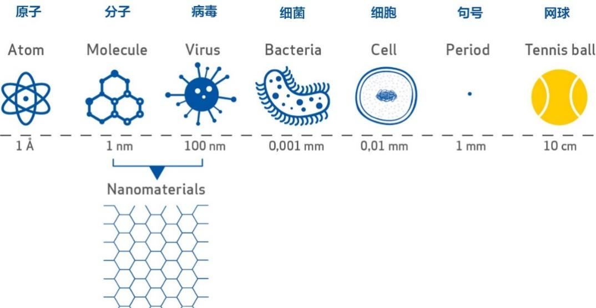
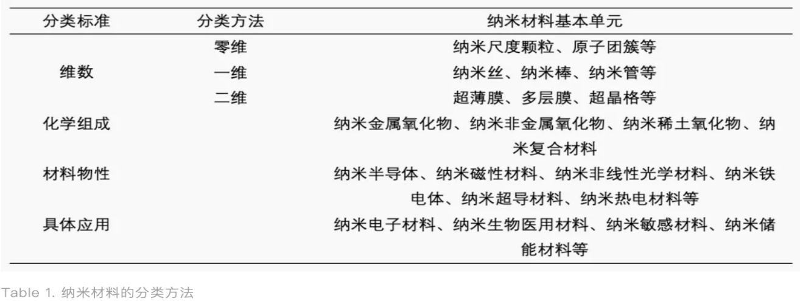

__            __

                  

题目：纳米技术及纳米机器人的应用和现状

                    学院机械工程学院

                年级：2025级

姓名及专业：

汪翔天（智能制造工程2班3025002347）

黄子烨（机械设计制造及其自动化6班3025002342）

钟乐昕（机械设计制造及其自动化2班3025002344\)

          马锦龙（机械设计制造及其自动化3班3025002362）

                   摘要

	微纳尺度技术是精密工程、机器人学与材料科学交叉形成的前沿学科，微纳米机器人依托精密制造、柔性驱动与功能纳米材料协同赋能，是突破高端制造、精准医疗领域技术瓶颈的核心装备。本文以纳米技术与纳米机器人为研究对象，首先梳理微纳操控与微纳米机器人三大发展阶段，系统对比国内外在精密加工、柔顺机构、纳米材料方向的研究优势与不足；其次分别阐述该技术在机械微纳加工、柔性精密驱动、纳米材料改性三大场景的应用现状，剖析仿真建模、装备开发、试验验证全链条现存技术短板；随后从复合材料、半导体制造、纳米涂层、纺织、切削刀具、生物医疗六大领域，归纳纳米技术产业化落地面临的材料团聚、物理极限、耐久性不足、生物安全、能量供给、微观操控困难等共性难题，并总结量产成本高、微观性能难向宏观环境迁移、实时检测难度大三大行业痛点；最后对纳米技术在精准医疗、清洁能源、新一代信息芯片、脑机接口等方向进行发展展望，同时从科学工程、生态健康、社会伦理维度辩证分析技术发展的潜在风险，提出同步完善毒理研究、建立全球统一监管与安全规范的发展思路。研究表明，当前单一技术维度创新已难以突破行业瓶颈，构建 “材料改性 \- 结构优化 \- 精密制造 \- 精准驱动” 一体化研发体系，攻克尺度适配、多场耦合、生物兼容等关键难题，是推动纳米机器人规模化工程应用、实现纳米技术可持续健康发展的核心路径。

关键词：纳米技术；微纳米机器人；柔性驱动；纳米材料；精密制造；生物医疗

                                Abstract

As an interdisciplinary frontier integrating precision engineering, robotics and materials science, micro\-nano scale technology underpins micro\-nanorobots empowered by the synergy of precision manufacturing, flexible actuation and functional nanomaterials, which serve as core equipment to break through technical bottlenecks in high\-end manufacturing and precision medicine\. Taking nanotechnology and nanorobots as the research objects, this paper firstly sorts out three developmental stages of micro\-nano manipulation and micro\-nanorobots, and systematically compares the domestic and international research strengths and deficiencies in precision machining, compliant mechanisms and nanomaterials\. Secondly, it elaborates the application status of relevant technologies in three major scenarios including mechanical micro\-nano machining, flexible precision actuation and nanomaterial modification, and analyzes the technical shortcomings existing in the whole chain of simulation modeling, equipment development and experimental verification\.Furthermore, this paper summarizes industrialized challenges of nanotechnology in six fields, namely nanocomposites, semiconductor manufacturing, nanocoatings, textile industry, cutting tools and biomedicine, including material agglomeration, physical limits, poor durability, biosafety risks, energy supply difficulties and obstacles in microscale manipulation\. Three universal industrial pain points are concluded: high mass production costs, failure of microscale superior properties under complex macroscopic environments, and great difficulties in real\-time detection\. Afterwards, prospects are presented for the breakthroughs of nanotechnology in precision medicine, clean energy, next\-generation information chips, brain\-computer interfaces and other cutting\-edge fields\. Meanwhile, potential risks brought by technological advancement are dialectically analyzed from scientific engineering, ecological health and social ethical perspectives\. A development roadmap is proposed to synchronously advance toxicological research and establish globally unified supervision and safety standards\.

The study demonstrates that innovations confined to a single technical dimension can hardly overcome current industrial bottlenecks\. Constructing an integrated research and development system covering "material modification, structural optimization, precision manufacturing and precise actuation" to tackle critical challenges such as scale adaptation and multi\-field coupling as well as biocompatibility constitutes the core approach to promote large\-scale engineering applications of nanorobots and realize the sustainable and sound development of nanotechnology\.

Keywords: Nanotechnology; Micro\-nanorobots; Flexible Actuation; Nanomaterials; Precision Manufacturing; Biomedical Engineering

目录

[        摘要	2](#_Toc29316)

第一章：绪论\.\.\.\.\.\.\.\.\.\.\.\.\.\.\.\.\.\.\.\.\.\.\.\.\.\.\.\.\.\.\.\.\.\.\.\.\.\.\.\.\.\.\.\.\.\.\.\.\.\.\.\.\.\.\.\.\.\.\.\.\.\.\.\.\.\.\.\.\.\.\.\.\.\.\.\.\.\.\.\.\.\.\.\.\.\.\.\.\.\.\.\.\.\.\.\.\.\.\.\.\.\.\.\.\.\.\.\.\.\.\.\.\.\.\.\.\.\.\.\.\.\.\.\.\.\.\.\.\.\.\.\.\.\.5

[第二章：研究背景	6](#_Toc5298)

[第三章：微纳操作和微纳米机器人的应用现状	10](#_Toc3735)

[第四章：目前所面临的问题	18](#_Toc8264)

[第五章：展望与思考总结	21](#_Toc19208)

w

__第一章：绪论__

__1\.1绪论__

微纳尺度技术是精密工程、机器人学与材料科学交叉融合的前沿领域，打破了传统宏观机械系统的尺寸与性能局限，可为微观精密操控、高端微纳器件制造、生物医学精密作业等场景提供核心技术支撑。其中，微纳操作技术依托高精度运动控制与微观交互机制，可实现微米、纳米尺度物体的夹持、搬运、组装与改性作业；微纳米机器人作为跨界融合的智能载体，具备尺寸微小、操控精准、环境适配性强等优势，是破解高端制造、精密医疗领域技术瓶颈的核心工具。当前，高端装备制造、精准生物医疗等产业高速发展，对微纳作业的精度、稳定性与智能化水平要求持续提升，传统宏观机械系统的尺度效应、摩擦效应及加工精度短板日益凸显，无法适配纳米级精密操控、柔性微观适配等核心需求。因此，融合精密制造、柔性驱动与纳米材料的协同创新，已成为微纳工程领域的研究热点与技术升级关键突破口。

精密机械制造是微纳操作装备与微纳米机器人结构成型、尺度控制与稳定服役的基础，直接决定设备的结构精度、力学性能与作业可靠性。传统宏观制造工艺难以满足微纳构件高精度、轻量化、复杂化的成型需求，而飞秒激光微纳加工、微注塑成型、电化学刻蚀、高精度光刻等现代先进工艺，可实现微米级结构轮廓精度与纳米级表面粗糙度控制，高效完成异形、薄壁、多孔等复杂微结构一体化成型，解决了传统工艺尺寸偏差大、一致性差、构件易变形等问题。现阶段，微纳精密制造已从单一构件加工，升级为多尺度、多材料一体化集成制造，可有效规避微尺度效应引发的力学性能衰减问题，提升装备的结构刚度与定位精度，广泛应用于微夹持器、微型传动机构、机器人骨架等核心部件制备。但该领域仍存在异质材料加工难度大、批量制造精度不足、残余应力控制困难等短板，制约了相关装备的产业化落地。

柔性机构与精密驱动技术是实现微纳高精度、自适应作业的核心，有效突破了传统刚性机构刚度固定、适配性差、易损伤作业对象的局限。微纳尺度作业存在接触力微小、操作对象脆弱、微环境复杂等特点，刚性机构极易引发定位偏差、对象损伤等问题，而柔性机构依靠材料弹性变形实现运动与力控，无传动间隙和摩擦磨损，兼具高精度与高柔顺性。依托拓扑优化、伪刚体模型的设计理论，可搭建多自由度微纳柔顺操作机构，满足纳米级定位、微弧度级角度调控的超精密作业需求。在驱动层面，压电驱动因分辨率高、响应快、结构紧凑成为主流方式，磁驱动、光驱动等非接触驱动可适配生物、液体微环境无损伤作业场景。二者的协同配合，实现了微尺度力\-位移精准耦合控制，但目前仍存在柔性机构变形量有限、承载能力弱，驱动系统微尺度漂移、多自由度协同控制精度不足等问题，难以支撑复杂场景下的批量高精度作业。

纳米材料是微纳装备实现性能突破、功能拓展的关键载体，直接决定设备的力学性能与环境适配能力。传统金属、高分子材料在微纳尺度下强度不足、耐磨性差、无智能响应，无法适配高端微纳作业需求。而石墨烯、碳纳米管、智能水凝胶、介电弹性体等功能纳米材料，凭借超高比强度、可控形变响应等优势，成为核心制备材料。其中，柔性智能纳米材料可实现驱动、感知、操作一体化，纳米复合材料可提升设备抗疲劳性能，功能性纳米涂层可优化表面特性与生物相容性，全方位拓展了微纳机器人的作业场景。不过，该领域仍存在材料成型一致性差、多材料界面结合强度低、性能易受微环境干扰等问题，且材料、结构与驱动的协同设计体系尚未完善，无法充分发挥纳米材料的性能优势。

综上，精密机械制造、柔性精密驱动、功能纳米材料三大技术体系深度耦合、相辅相成，构成了微纳操作与微纳米机器人的技术核心。单一领域的创新已无法突破现有技术瓶颈，亟需构建“材料改性\-结构优化\-精密制造\-精准驱动”一体化研发体系，攻克尺度精度不足、驱动控制滞后、材料性能受限等关键难题。本文围绕三大核心技术方向开展系统性研究，优化结构设计、制造工艺与驱动控制方案，旨在提升微纳机器人的作业精度、稳定性与场景适配能力，为其在微纳制造、生物医疗、精密传感等领域的工程应用提供理论与技术支撑。

# __第二章：研究背景__

微纳操作与微纳米机器人是精密机械工程、材料科学与智能机器人交叉融合的前沿领域，突破了传统宏观装备的尺度局限，可实现微观尺度精准操控与智能作业。依托机械制造工艺迭代、柔性机构与精密驱动技术革新、纳米材料体系升级，该领域技术演进可划分为理论萌芽与静态操控、结构成型与主动驱动、智能融合与多功能集成三个阶段，层层迭代构建了现代微纳机器人技术体系，为高端微纳制造、精准生物医疗等领域应用奠定了核心基础。

__2\.1 发展历程__

2\.1\.1、理论萌芽与静态微纳操控阶段（20世纪60年代至90年代初）

本阶段为微纳技术体系奠基期，核心特征为理论探索与静态被动操控，尚未形成成熟的微纳米机器人系统。1959年费曼的微观机械构想，开启了微纳尺度工程研究先河，为微观精密操控技术发展提供核心理论支撑。受限于彼时技术水平，精密机械制造仅能完成微米级简易结构加工，工艺精度与结构复杂度不足，无法支撑微型机器人本体成型；机构设计以刚性结构为主，存在传动间隙大、无自适应能力等缺陷，仅可实现简单定位夹持作业。

同时，该阶段驱动技术精度较低，无法实现纳米级调控，且无功能纳米材料应用，微构件力学性能单一、功能性匮乏。整体作业依赖人工辅助与显微设备，仅能完成微观试样静态观测与简单位移调试，属于被动式操控范畴。但本阶段验证了微纳尺度精密作业的可行性，积累了基础理论与实践经验，为后续技术突破筑牢根基。

2\.1\.2、结构成型与主动驱动作业阶段（20世纪90年代至21世纪初）

本阶段为技术快速成长期，实现了从静态被动操控向动态主动作业的关键跨越，微纳米机器人本体结构初步成型。精密机械制造技术取得突破性进展，高精度光刻、微蚀刻、激光微加工等工艺日趋成熟，可稳定制备高精度微米级构件，实现微夹持器、微型传动结构等核心部件一体化成型，解决了早期微结构加工精度低、一致性差的行业难题。

柔性机构设计理念首次落地微纳作业领域，依托基础优化方法研发的无间隙、低磨损柔性微机构，有效规避了刚性结构的作业冲击与定位偏差问题。压电、静电等新型精密驱动技术的普及，实现了纳米级位移分辨率动态响应，构建起结构与驱动协同的主动作业体系。纳米材料初步投入应用，通过纳米涂层、改性填充等方式优化微构件耐磨性能与结构稳定性。此阶段微纳设备可完成预设轨迹程序化动态作业，但仍存在功能单一、无自主决策能力、复杂环境适配性弱等短板。

2\.1\.3、智能融合与多功能集成发展阶段（21世纪10年代至今）

近十余年，多学科深度交叉融合，推动微纳操作与微纳米机器人进入智能化、多功能化发展新阶段，实现了程序化作业向自适应智能作业的跨越式升级。制造层面，微纳3D打印、异质材料一体化加工等先进工艺，可实现复杂轻量化微纳结构高精度成型，满足多功能机器人集成制造需求。

柔性机构与多场耦合精密驱动技术深度融合，多自由度柔性操作结构搭配闭环控制系统，有效解决了微纳作业精度漂移、柔性样本损伤等难题。机器视觉与智能算法的融入，赋予机器人环境感知、自主轨迹规划能力。石墨烯、智能水凝胶等功能纳米材料成为核心赋能载体，凭借优异的力学性能、生物相容性与外场响应特性，赋予机器人柔性驱动、靶向作业、自感知等新功能，催生了医用微机器人、微纳器件组装机器人等新型装备。

综上，三个发展阶段完整呈现了微纳技术从理论构想、结构落地到智能集成的演进过程，形成了精密制造、柔性驱动、纳米材料协同赋能的技术体系。现阶段该领域持续向高精度、高适配、智能化方向突破，为高端制造与精准医疗产业发展提供重要支撑。

__2\.2 微纳操作与微纳米机器人国内外研究现状__

微纳操作技术与微纳米机器人依托多学科交叉优势，成为微观精密作业、生物医学工程、微纳器件集成的核心研究方向。经过数十年技术迭代，国内外科研团队围绕微纳结构精密制备、高精度柔顺驱动控制、功能材料改性应用等核心方向开展系统性研究，形成优势互补的研究体系。整体而言，国外研究起步早、基础理论成熟，原创性技术积累深厚；国内近年发展迅猛，在工艺集成、装备研发与场景应用领域快速赶超，形成国内外协同突破的发展格局。

2\.2\.1、国外研究现状

欧美、日本等发达国家是该领域先行者，自20世纪80年代起依托成熟的精密制造体系，率先开展微纳尺度操控机理与微型机器人系统研究，构建了完善的理论、工艺与装备体系。精密制造领域，国外率先突破光刻、微蚀刻、飞秒激光微加工等超精密工艺，实现微米至纳米级跨尺度结构高精度成型与批量制备。麻省理工学院、加州理工学院等团队建立微纳一体化制造工艺体系，实现异形薄壁微构件无残余应力加工，搭建完善的微尺度误差补偿理论，有效解决了微纳制造的尺寸效应与表面效应难题。

柔性机构与精密驱动领域，国外奠定了微纳柔顺机构核心设计理论，伪刚体模型、拓扑优化等经典方法均由欧美团队率先提出，为柔性机构研发提供理论基石。美、日团队研发的高性能压电、磁致伸缩微驱动器件，具备纳米级位移分辨率与微秒级动态响应，构建了多场耦合驱动控制体系。同时率先实现柔性机构与精密驱动一体化集成，开发多自由度柔顺操作平台，可完成单细胞夹持、纳米器件组装等无损伤超精密作业，在力控精度与动态稳定性上长期保持领先，且在机器人自主轨迹规划、集群控制领域起步更早，可实现复杂微环境自适应作业。

纳米材料应用领域，国外率先将石墨烯、碳纳米管、智能水凝胶等功能材料引入微纳机器人领域，系统探究材料力学响应、外场驱动与生物适配特性。通过纳米复合材料改性技术提升机构结构强度与抗疲劳性能，基于智能材料开发光、热、磁响应型微机器人，实现材料驱动、感知、作业一体化，在医用靶向递送、微环境检测等场景完成原理性验证，原创成果丰硕。

2\.2\.2、国内研究现状

国内微纳操作与微纳米机器人研究起步较晚，但近十余年依托国家高端装备、精密工程与生物医药战略布局实现跨越式发展，跻身国际第一梯队，形成特色化技术体系。精密制造领域，哈尔滨工业大学、浙江大学、中科院沈阳自动化所等团队，深耕激光微纳加工、微3D打印、异质材料一体化成型工艺，突破国外技术壁垒，攻克微构件残余应力控制、批量加工一致性差等行业难题。目前国产微纳加工装备可稳定实现纳米级表面精度控制，满足微操作末端执行器、机器人骨架等核心部件的工程化制备需求，产业化适配能力持续提升。

柔性机构与精密驱动领域，国内聚焦工程化适配与性能优化，突破了传统柔性机构变形量有限、承载弱、精度不足的瓶颈。基于拓扑优化与多目标参数优化方法，创新设计多自由度并联柔性微操作机构，大幅提升作业柔顺性与环境适配性。在驱动控制方面，压电驱动闭环控制、磁光耦合协同驱动、微力精准调控等技术取得显著突破，自研控制系统有效抑制微尺度位移漂移与动态滞后，实现纳米级定位与微牛顿级力控作业，广泛应用于微器件组装、细胞操控等场景，在智能控制、自主规划、多机协同等应用层面迭代迅速，工程实用性优势突出。

纳米材料赋能领域，国内聚焦材料改性与功能集成创新，构建适配微纳机器人的材料应用体系。通过纳米掺杂、表面改性、复合成型等技术，优化微纳机构耐磨性能、力学稳定性与生物相容性。同时在智能响应、生物复合纳米材料领域成果丰硕，研发出适配体内微环境的医用柔性微机器人、水环境修复微纳操作机器人，实现材料、结构与驱动控制深度耦合，有效拓展了装备应用场景与服役性能。

2\.2\.3、国内外研究对比与现存共性问题

国内外研究呈现显著差异化优势：国外基础理论深厚、原创技术密集、核心器件领先，在微纳作用机理、新型驱动原理、前沿材料基础研究中占据主导；国内侧重技术集成与工程落地，工艺优化、装备自研、场景化应用、智能控制能力赶超迅速，技术落地规模位居国际前列。目前领域存在三大共性技术瓶颈：一是材料\-结构\-驱动协同设计体系不完善，多技术耦合精度受限；二是柔性微机构普遍存在承载能力与稳定性矛盾，极端微环境适配性不足；三是纳米材料成型一致性、界面结合强度偏低，制约装备长期稳定服役与产业化落地。

# __第三章：微纳操作和微纳米机器人的应用现状__

__3\.1 微纳操作和微纳米机器人在机械制造领域的应用现状__

3\.1\.1、探针针尖纳米通道刻划建模仿真技术应用现状

纳米尺度加工受尺度效应、表面效应、晶格畸变、弹性回复等微观机制主导，传统宏观切削模型不再适用，建模仿真成为解析加工机理、优化工艺参数的核心前置手段。国内外依托分子动力学、有限元仿真、多场耦合建模技术，搭建了完善的仿真理论体系。

国外仿真技术起步早、体系成熟，20世纪90年代便将分子动力学仿真引入微纳刻划领域，实现探针与工件原子交互过程可视化模拟，精准解析单晶材料微观变形机制。研究从早期二维沟槽仿真逐步迭代至三维立体模型，纳入针尖磨损、晶格各向异性等实际干扰因素，通过多尺度耦合仿真兼顾微观原子变形与宏观应力、温度场计算，可精准预判通道形貌、侧壁垂直度等核心指标，同时针对新型基材建立差异化仿真模型，为工艺设计提供理论支撑。

国内仿真研究迭代速度快、工程适配性强，哈工大、浙大、中科院精密所等团队聚焦脆性材料，搭建精细化分子动力学仿真模型，系统分析工艺参数对通道成型质量的影响，阐明微裂纹抑制机制，解决了脆性材料加工崩边、损伤严重等问题。国内仿真紧扣工程痛点，纳入针尖磨损、环境扰动、工件倾斜等干扰因素，构建真实工况仿真体系，创新参数反向优化体系，可实现异形三维纳米通道精准预判，整体精度达国际先进水平，但在柔性材料大变形刻划、针尖动态磨损实时仿真等领域仍有短板。

当前仿真领域普遍存在共性问题，多数模型基于理想工况假设，未充分考虑针尖误差、环境波动等干扰，仿真与试验偏差较大，且多材料复合结构仿真模型稀缺，难以适配复合型微纳器件加工需求。

3\.1\.2、微纳加工装备探针系统开发技术应用现状

探针执行系统是三维纳米形貌加工的核心硬件，其精度、稳定性直接决定加工质量。传统商用AFM探针仅支持二维刻划，存在行程小、姿态固定、载荷稳定性差等缺陷，无法满足三维复杂结构加工需求。国内外持续迭代探针系统设计、驱动集成与误差补偿技术，实现了从二维平面到三维立体精密加工的跨越。

国外探针装备技术积累深厚，商业化体系成熟。美、日、德率先研发专用三维刻划探针系统，创新设计多自由度柔性执行机构，集成高精度压电驱动、微力传感与姿态微调单元，运动分辨率达纳米级、载荷精度达微牛级，搭建“驱动\-传感\-控制\-检测”一体化架构，可实时动态补偿误差，适配多类基材加工，稳定实现原子级深度、纳米级精度的三维结构加工。

国内早期依赖进口设备，存在成本高、技术受限等问题，近年实现跨越式突破，攻克高精度微驱动、微力传感、姿态调控、动态误差补偿等核心技术。自主设计一体化探针夹持微调机构，提升结构刚度与抗振能力，优化压电驱动控制算法，有效抑制加工漂移与精度衰减。目前国产探针系统已搭载自研三维微纳刻划机床，可完成三维纳米通道、异形微结构一体化加工，核心精度对标国际水平，具备高性价比产业化优势。

该领域现存短板：高端传感芯片、核心探针部件部分依赖进口；探针磨损补偿与寿命预测技术不完善；高速动态加工工况下，系统响应滞后、微振动干扰等问题未彻底解决。

3\.1\.3、针尖微纳加工试验验证技术应用现状

试验验证是校准仿真模型、优化工艺参数、保障加工质量的核心支撑。国内外围绕纳米刻划开展大量系统性试验，探明了工艺参数与成型质量、加工缺陷的关联规律，构建了完善的工艺数据库。

国外试验体系完备、工况覆盖全面，侧重基础机理与极限性能研究。从早期单变量参数试验，逐步升级为多参数耦合、极端工况、耐久性试验，对比分析不同材料的差异化成型特性，搭建精细化分类工艺库，率先实现单原子层极限刻划，探明针尖磨损与精度衰减规律，建立标准化设备校准体系。

国内试验聚焦工程痛点，实用性突出。针对国产装备加工崩边、尺寸偏差、亚表面损伤等问题，采用正交试验、响应面试验优化工艺参数组合，围绕主流加工材料开展专项适配试验，优化加工启停、轨迹衔接工艺，大幅提升批量加工一致性与合格率。国内试验体系完全适配国产化装备，可稳定实现高精度三维纳米形貌加工。

现阶段试验领域存在明显短板：极端环境试验数据匮乏；多材料复合结构刻划试验研究不足；试验数据标准化程度低，行业统一工艺标准缺失，制约技术规模化推广。

__3\.2微纳操作和为纳米机器人在柔性机构和精密驱动的应用现状 __

柔性机构依托材料弹性形变实现运动与力的传递，具备无摩擦、无间隙、高重复精度等优势，适配微纳超精密作业工况。但微纳尺度下的尺度效应、几何大变形非线性、多场耦合扰动等问题，导致传统刚性力学模型与线性假设无法精准描述其运动规律，建模仿真成为机构设计、性能优化、误差抑制的核心技术。

3\.2\.1、国内外仿真技术研究现状

国外柔性机构仿真起步早、理论体系完善，早期建立柔性铰链、簧片单元线性仿真模型，奠定理论基础。随着精密驱动技术升级，突破线性建模局限，攻克几何、材料、接触非线性仿真难题，精准揭示大变形下刚度突变、应力集中、耦合误差等机理。近年重点发展多场耦合与多尺度仿真，构建“力\-电\-热\-结构”协同仿真体系，求解驱动迟滞、温度漂移引发的误差，结合智能算法完成结构与参数正向优化，支撑高端精密驱动系统研发。

国内仿真发展迅速、工程适配性强，哈工大、浙大等团队聚焦微纳夹持、精密定位场景，搭建非线性有限元仿真模型。区别于国外基础研究，国内重点引入加工残余应力、装配误差、环境扰动等实际干扰因素，精准预判设备定位偏差与疲劳损伤。同时创新参数反向优化体系，针对性研发压电驱动迟滞补偿模型，有效解决精密驱动非线性输出难题，整体精度达国际先进水平，仅在极端工况耦合仿真、长期疲劳精细化仿真领域存在短板。

3\.2\.2、柔性机构与精密驱动系统结构开发技术应用现状

柔性机构与精密驱动系统是微纳精密装备的核心硬件，可彻底规避传统刚性机构的间隙摩擦、装配误差、磨损老化等固有缺陷。国外在构型设计与系统开发领域积累深厚，从单自由度柔性铰链结构，迭代至多自由度并联、复合柔性构型，开发Zigzag簧片、仿生柔性关节等新型结构，破解“精度与行程互斥”难题，实现毫米级运动行程与纳米级定位精度兼顾。通过集成多类驱动与传感单元，搭建一体化闭环控制系统，核心响应精度、力控性能长期领先，且模块化、标准化程度高，适配高端定制化加工需求。

国内近年实现技术跨越式突破，打破国外垄断。科研团队通过拓扑与尺寸优化，自主研发复合型柔性铰链、对称式柔性导向、多维并联柔性平台，有效抑制微振动、动态漂移与耦合干扰，改善传统机构稳定性差、寿命短的缺陷。自研压电、音圈驱动控制系统，优化滤波与误差补偿算法，搭配微位移、微力实时检测模块形成闭环控制，大幅提升定位与重复定位精度。目前国产柔性驱动系统已批量搭载于自研微纳装备，可完成多维精密定位、柔性无损操作等复杂任务，性价比与产业化适配性优势显著，短板集中在高端驱动、传感部件国产化稳定性不足，多自由度耦合误差无法完全消除。

3\.3\.3、柔性机构与精密驱动试验验证技术应用现状

国外试验体系完备，从单参数基础试验逐步拓展至多参数耦合、极端工况、耐久性试验，探明不同柔性结构、驱动方式的性能差异与疲劳失效机理，建立精细化工艺数据库与设备校准标准，不断突破精密驱动极限性能。国内试验紧扣工程痛点，通过正交试验、响应面试验筛选最优工艺参数组合，重点解决国产装备迟滞误差大、重复精度低、稳定性不足等问题，针对性优化装配工艺与动态补偿策略，开展加速疲劳试验优化服役参数，试验数据高度贴合国产设备特性，工程实用性更强。

3\.2\.4、整体技术总结与现存共性问题

柔性机构与精密驱动技术已形成完整技术闭环，可支撑纳米级定位、高频动态响应、微力无损操控等核心功能。国外优势在于基础理论、非线性仿真、极限性能与核心部件研发；国内擅长国产化替代、结构创新、工艺优化与批量落地。领域核心瓶颈：仿真模型与真实服役工况适配性不足；高端核心部件国产化稳定性欠缺；多自由度耦合驱动误差难以消除；极端工况试验数据匮乏、行业标准缺失。

__3\.3纳米材料在微纳精密驱动与柔性机构领域的技术应用现状__

纳米材料具备高强度、低摩擦、优异力电响应与抗疲劳特性，是突破传统材料性能瓶颈、赋能柔性机构与精密驱动升级的核心载体。纳米尺度的尺寸效应与界面效应，导致传统宏观模型无法适配其性能演化规律，多尺度耦合仿真与试验验证成为材料应用的核心研究手段。

3\.3\.1、纳米材料多尺度建模仿真技术应用现状

国外率先将分子动力学仿真应用于纳米材料研究，精准解析材料拉伸、弯曲、界面脱粘等微观机理，从单一材料线弹性仿真迭代至多材料、多场耦合多尺度仿真体系，实现材料配比、结构构型正向优化，大幅提升纳米改性构件的稳定性与精度。国内仿真研究聚焦工程实际，纳入制备缺陷、界面杂质、环境扰动等因素，构建精细化工况模型，优化纳米填料比例、涂层厚度等核心参数，预判构件屈曲失效与界面脱粘问题，整体精度达国际先进水平，仅在极端工况、多层纳米结构仿真领域存在短板。当前仿真普遍存在模型理想化、复合体系仿真缺失等问题，制约技术进阶。

__3\.3\.2纳米材料精密结构与功能应用技术现状__

纳米材料可有效解决传统柔性机构刚度不足、磨损严重、迟滞误差大、寿命短等缺陷，形成结构增强、界面改性、功能驱动、精准传感四大应用体系。国外早期利用碳纳米管、石墨烯制备柔性核心构件，通过纳米陶瓷涂层降低摩擦磨损，近年聚焦多功能集成，研发纳米压电、MXene驱动传感一体化单元，破解精度与行程互斥瓶颈，高端定制化技术优势显著。

国内突破进口技术壁垒，实现纳米材料国产化规模化应用。通过纳米掺杂、复合改性技术，提升柔性构件抗疲劳性能与形变稳定性，优化涂层工艺降低微尺度磨损；突破纳米压电薄膜制备技术，有效降低驱动迟滞误差、提升定位精度。国产纳米改性构件、防护涂层、微型传感驱动单元可完全替代进口产品，性价比与批量适配性优势突出，短板为高端纳米薄膜制备工艺、复杂异形结构成型精度不足，极端工况下材料性能衰减明显。

3\.3\.3、纳米材料精密应用试验验证技术现状

国外搭建了完备的纳米材料试验体系，从基础力学性能测试拓展至极端工况、耐久性、多参数耦合试验，探明材料界面作用机理与性能衰减规律，建立标准化工艺与校准体系。国内聚焦国产材料均匀性差、界面强度低、性能漂移等工程难题，通过科学试验方法优化配比与制备工艺，提升材料稳定性与构件适配性，开展疲劳试验探明老化失效规律，有效延长装备服役寿命，试验体系实用性、落地性更强。目前领域普遍存在极端工况数据匮乏、复合体系试验不足、行业标准缺失等问题。

3\.3\.4整体技术总结与现存共性问题

纳米材料技术已实现从机理研究到工程落地的全链条突破，是微纳柔性机构与精密驱动领域的核心赋能技术，有效破解了传统装备精度受限、稳定性不足、功能单一等瓶颈。国内外技术差异化互补，国外基础研究与极限性能领先，国内工程化、产业化落地优势突出。现阶段核心技术瓶颈：仿真模型与真实服役工况适配性不足；高端纳米材料与制备工艺国产化短板明显；纳米结构长期服役界面稳定性差、批量一致性不足；极端工况试验数据与行业标准缺失，难以适配高端装备产业化需求。

#      第四章：目前所面临的问题

纳米技术虽然已被使用在部分场景如半导体芯片的纳米级光刻，汽车和航空航天的制造等领域但仍然存在许多问题急需解决：

__4\.1、纳米复合材料（汽车/航空）：极易“抱团”与回收难题__

尽管纳米碳管和石墨烯理论强度惊人，但在实际大批量工业生产中，情况大打折扣。

4\.1\.1、技术瓶颈（分散困难）：

   纳米颗粒由于表面能极高，相互之间有极强的吸引力，在熔融的塑料或金属中极易像面粉一样结块、聚集成团（Agglomeration）。一旦无法均匀分散，结块处反而会变成材料最脆弱的“断裂点”，导致材料强度不升反降。

4\.1\.2、回收与环保局限：

传统的金属或塑料很容易熔化后二次循环使用。但混入了纳米碳管的复合材料极难回收，如何将纳米颗粒与基体重新分离是目前行业的噩梦，大多只能降级使用或焚烧，不符合现代绿色制造的趋势。

__4\.2、半导体芯片纳米加工：量子隧穿效应与光刻机物理极限__

芯片制造如今已经逼近原子尺度的物理极限。

4\.2\.1、物理瓶颈（量子隧穿效应）：

当芯片内的导线线宽缩小到几纳米（约几十个原子厚度）时，经典的物理定律开始失效，量子效应显现。电子会直接“穿墙而过”（即量子隧穿），导致芯片严重漏电和发热。这就是为什么近年来芯片主频很难再大幅提升的核心原因。

4\.2\.2、生产局限（设备与良率）： 

能够制造纳米级芯片的ASML极紫外（EUV）光刻机，一台售价高达数亿美元，且极度耗电（单台大功率EUV光刻机一天的耗电量堪比一个小型城镇）。同时，只要空气中有一粒微纳米级的灰尘落在晶圆上，整片价值数万美元的晶圆就会直接报废，维持高良品率的成本极高。

__4\.3、 高性能纳米涂料（建材/船舶）：不耐磨与“短命”问题__

纳米自清洁玻璃和防腐漆在实验室里表现完美，但在长期的风吹日晒下会迅速“露怯”。

4\.3\.1技术问题（耐久性差）： 

纳米涂层通常只有几十到几百纳米厚。在实际户外环境中，大风带来的沙尘刮擦、酸雨腐蚀以及强烈的紫外线照射，会迅速破坏纳米二氧化钛或疏水材料的微观结构。

4\.3\.2局限性（维护成本高）： 

汽车的“纳米隐形车衣”或玻璃的自清洁涂层，往往在1\-2年后就会局部失效，失去防污或超亲水效果。频繁地重新喷涂、维护，其成本让很多建筑业主和普通消费者望而却步。

__4\.4、 纺织服装业：洗涤流失与潜在的“健康隐形杀手”__

纳米衣服虽然防水防臭，但它在洗涤过程中的变化引发了巨大的担忧。

4\.4\.1技术瓶颈（结合不牢）： 

很多纳米面料是通过后整理工艺将纳米银或纳米防水剂“粘”在衣服纤维表面，而不是长在纤维内部。在洗衣机强大的机械搅拌和洗衣粉的化学作用下，纳米颗粒会随着洗涤废水大量脱落。

4\.4\.2环境与健康局限：

脱落的纳米银会进入城市污水系统，它强大的抗菌能力会杀死污水处理厂赖以净化水质的有益细菌，甚至流入自然水体破坏生态平衡。

有研究担忧，极微小的纳米颗粒可能通过皮肤毛孔直接进入人体循环，其长期的生物安全性尚未得到完全证实。

__4\.5、机械加工刀具：高温退火与基体结合力不足__

在CNC数控机床的高速切削中，纳米涂层承受着极端的物理压力。

4\.5\.1技术问题（界面剥离）：

纳米涂层（如 TiAlN）与硬质合金刀基体是两种完全不同的材料，在每分钟数千转的高速摩擦下，交界处会产生巨大的剪切应力。一旦工艺控制不好，涂层非常容易像墙皮一样整块剥落（Delamination），导致刀具瞬间报废。

4\.5\.1局限性（极端高温失效）：

尽管纳米多层涂层很耐磨，但当切削钛合金等难加工材料、局部温度突破1000°C时，纳米结构会发生“再结晶”或退火，导致原本排列紧密的纳米晶粒长大，从而失去原有的高硬度特性。

__4\.6、医疗领域：__

纳米机器人（Nanorobots）是目前前沿科学中最具诱惑力的领域之一，尤其在精准医疗、靶向治疗和微纳制造方面被寄予厚望。然而，从科幻走向现实，纳米机器人目前正面临着巨大的技术瓶颈和理论挑战。要让纳米机器人真正进入人体或复杂环境中工作，目前主要存在以下几个核心问题：

4\.6\.1\. 动力与能量供应问题

在宏观世界中，机器人可以用电池或插电。但在纳米尺度（10^\{\-9\} 米）下，传统的电池根本无法缩放至如此微小的体积。能量密度不足： 微型化学电池的储能极其有限，很难维持机器人长时间工作。外部驱动的局限： 目前主流的研究是利用外部物理场（如磁场、超声波、光场）来驱动纳米机器人。例如，通过改变外部磁场方向来让磁性纳米颗粒“游动”。但这种方法在深入人体深层组织（如大脑或内脏深处）时，外部信号会产生衰减，难以做到绝对精准的个体控制。如果成千上万个纳米机器人一起进去，很难做到“你往左，他往右”的独立操控。

4\.6\.2\. 流体力学阻力

在微观世界中，物理定律的流动特性发生了根本性的改变。低雷诺数环境： 在纳米尺度下，流体的黏性力远大于惯性力（即处于极低的雷诺数 Re 环境中）。对纳米机器人来说，血液或细胞液的黏稠度就像人类在厚重的蜂蜜或沥青中游泳。

传统游动方式失效： 宏观世界中鱼儿摆尾、螺旋桨旋转的推进方式在纳米尺度下几乎没有效果。纳米机器人必须采用特殊的非对称运动（如类似细菌鞭毛的螺旋运动）才能前进，这对结构设计和加工提出了极高要求。

4\.6\.3\. 靶向识别与精确导航

纳米机器人进入人体后，如何精准找到病灶（如癌细胞）是一个巨大难题。布朗运动干扰： 在纳米尺度下，分子的无规则热运动（布朗运动）非常剧烈。纳米机器人就像在狂风暴雨中行驶的小船，很容易被撞得偏离航线。复杂的体内环境： 人体内部血管错综复杂，血流速度各不相同。如何让纳米机器人逆流而上，并准确识别出“敌人”（病变细胞）而误伤“友军”（正常细胞），目前主要依赖化学修饰（如表面绑定特定抗体），但识别的成功率和特异性依然不够完美。

4\.6\.4\. 生物相容性与安全性

这是临床应用中最致命的瓶颈。免疫系统清除： 人体的免疫系统（如巨噬细胞）非常强大。 任何外来物质进入血液，都会被免疫系统视为“敌人”并迅速吞噬、清除。如何给纳米机器人穿上“隐身衣”（如伪装成红细胞膜），不被免疫系统消灭，是目前攻克的难点。材料毒性与代谢： 很多高效的纳米机器人是由金属（如金、铁、铂）或半导体材料制成的。它们在完成任务后，如何排出体外？ 如果长期滞留在肝脏、肾脏或大脑中，是否会引起慢性重金属中毒或细胞变异？目前生物降解型纳米机器人（如用DNA、蛋白质构建）虽然安全，但强度和控制力又大打折扣。

4\.6\.6\. 通信与反馈控制

信号传不出： 纳米机器人太小，无法安装无线电天线或传感器。当它在体内某处释放了药物，或者发现了癌细胞，它无法直接发送信号给医生。监控手段模糊： 目前医生只能通过医学成像（如高分辨率MRI、荧光成像、超声）来观察大批纳米机器人的“群体行为”，根本无法看清单个机器人的工作状态，属于“半盲操”状态。

__4\.7、总结来说，目前所有纳米技术在生产制造中的局限性可以概括为三点：__

1、“生产不便宜”：需要极高纯度的原料和昂贵的真空、精密控制设备。

2、“微观完美，宏观脆弱”：在纳米尺度下完美的物理特性，一旦放到复杂的宏观日常环境（日晒、雨淋、摩擦）中，极易失效。

3、“检测极其困难”：工厂流水线上很难实时检测几纳米厚的涂层是否均匀，通常只能抽检或等出厂后发现次品，质控成本高昂。

#      第五章：展望与思考总结

纳米技术（Nanotechnology）在过去几十年中，已经从一个纯粹的科学概念演变为推动现代工业、医疗和信息技术发展的核心力量。通过在原子和分子尺度上操纵物质，人类正在重新定义材料的极限。

__5\.1、纳米技术的核心总结__

纳米技术本质上是一场制造革命。它的核心价值在于：当材料被浓缩至纳米尺度时，其表面积会急剧增大，量子效应开始占据主导，从而展现出宏观状态下完全不具备的独特性质。结构与性能的飞跃： 纳米技术使传统材料在不改变化学成分的前提下，获得了极高的强度（如纳米碳管）、极强的催化活性（如纳米二氧化钛）以及优异的导电或隔热性能。多学科的深度交叉： 它不是一个孤立的学科，而是物理、化学、生物学、微电子学和材料科学的交汇点。已实现的产业化应用： 从智能手机里的芯片、汽车的轻量化纳米复合材料、高楼大厦的自清洁涂层，到防臭抗菌的衣物面料，纳米技术已经润物细无声地融入了人类的日常生活。

__5\.2、未来展望：纳米技术将如何重塑世界__

随着制造工艺的进一步精准和成本的下降，纳米技术在未来二三十年内，有望在以下几个颠覆性领域迎来爆发：

5\.2\.1、医疗领域的“精准革命”

智能靶向给药： 未来的纳米载体和微纳机器人能够识别特定的癌细胞标志物，将药物直接释放到病灶内部，实现“零副作用”治愈癌症。

体内实时监测： 长期驻留在血液或细胞液中的纳米传感器网络，能够在疾病（如心梗、脑梗或癌症）发生前的数月甚至数秒内发出预警。

人工器官与组织工程： 利用纳米级3D打印和生物支架技术，科学家将能够完美模拟人体细胞外基质，实现受损器官和神经的精准再生。

5\.2\.2、能源与环境的“绿色解药”

下一代高效能源： 纳米材料将使太阳能电池的光电转换效率突破现有极限；基于纳米多孔材料的固态电池和氢能储存技术，将彻底解决电动汽车的续航焦虑。

分子级环境治理： 纳米催化剂可以高效分解塑料微粒、吸附核废水中的重金属，甚至直接捕集空气中的二氧化碳并将其转化为低碳燃料。

5\.2\.3、信息技术与人机融合

超越摩尔定律： 基于二维纳米材料（如石墨烯、过渡金属硫化物）的光子芯片或量子芯片，将带来计算速度的指数级提升。

微观脑机接口： 能够穿过血脑屏障的纳米电极，可以实现更安全、高分辨率的神经信号读写，为人类意识与人工智能的融合奠定基础。

__5\.3、对纳米技术的深度思考__

站在技术爆发的前夜，我们在拥抱纳米技术带来红利的同时，也必须保持理性的审视。这项技术不仅考验着人类的工程能力，更考验着人类的伦理和治理智慧。

5\.3\.1、科学层面的思考：微观完美与宏观脆弱的平衡

目前的纳米技术往往在实验室（高度受控的环境）里表现惊艳，但在复杂的宏观现实（风吹日晒、机械磨损、复杂的生物体内环境）中极易失效、退化或团聚。如何实现长期的稳定性与高性价比的量产，是科学界必须跨越的鸿沟。

5\.3\.2、环境与健康层面的思考：“看不见”的隐形风险

纳米材料具有极强的穿透力，它们可以通过皮肤、呼吸道甚至血脑屏障直接进入生物体。纳米毒理学缺失： 目前人类对各类新型纳米颗粒在自然界循环、在食物链富集以及在人体内长期滞留的毒理学机制还知之甚少。新型环境污染： 随着纳米产品的普及，洗涤面料脱落的纳米颗粒、废弃电子产品中的纳米毒素如果流入土壤和水源，可能会对微观生态系统（如土壤益生菌、水生微生物）造成难以逆转的破坏。

5\.3\.2、社会与伦理层面的思考：不平等与安全红线

技术的“平权”问题： 纳米医疗或人机增强技术在早期必然成本高昂。如果这类技术演变为少数富裕阶层的特权，可能会在生物学层面上固化甚至扩大阶级鸿沟，导致“超人类”与普通人的分裂。安全与武器化风险： 纳米技术一旦被用于制造隐蔽性极强的生物/化学武器（纳米恐怖主义），其防御难度将远超传统武器。

__5\.4、结语__

纳米技术是人类从“利用自然赐予的材料”走向“在分子尺度上任意定制材料”的里程碑。它拉开了微观世界的大门，赋予了人类近乎“造物主”般的精密控制权。未来的纳米技术不应该是一匹脱缰的野马。唯有在发展技术的同时，同步建立起严密的纳米安全红线、完善纳米毒理学研究，并出台全球统一的伦理监管框架，人类才能确保这柄微观世界的“圣剑”真正造福于人类的未来，而不是成为毁灭生态的诱因。

参考文献：

1\.李隆球，周德开，常晓丛\. Design and manufacturing of micro/nanorobots \[J\]\. International Journal of Extreme Manufacturing, 2025\.

2\. 杨湛，福田敏男，史超阳\. From Nano Robotic Manipulation to Nano Manipulation Robot \[J\]\. SmartBot, 2025\.

3\. 孙立宁，杨湛。微纳机器人科学与技术发展现状与趋势 \[J\]\. 机器人，2026\.

4\. 邓杰，刘英想\. Review on Multiple\-Degree\-of\-Freedom Cross\-Scale Piezoelectric Actuation Technology \[J\]\. Advanced Intelligent Systems, 2024\.

5\. 孙钰院士专题《微纳操作与表征》\[J\]\. Engineering, 2025\.

6\. Advancement in Micro/Nanorobots in Medicine: Design, Actuation, and Transformative Application \[J\]\. ACS Omega, 2024\.

7\. Micro\- and nanomotors in biomedical applications \[J\]\. Progress in Polymer Science, 2025\.（Wiley 综述）

8\. 4D\-printed soft microrobots: manufacturing, materials, actuation and applications \[J\]\. Frontiers in Materials, 2026\.

9\. Why Magnetic Nanoparticles Still Struggle to Translate: A Systematic Analysis of Structural Gaps in Nanobiotechnology \[J\]\. Nanomaterials, 2026\.

