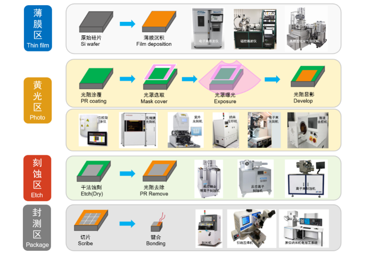
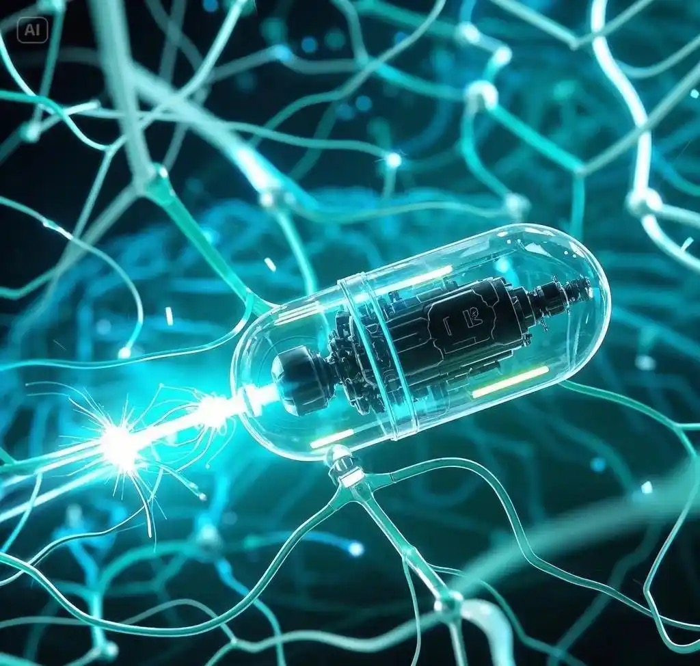
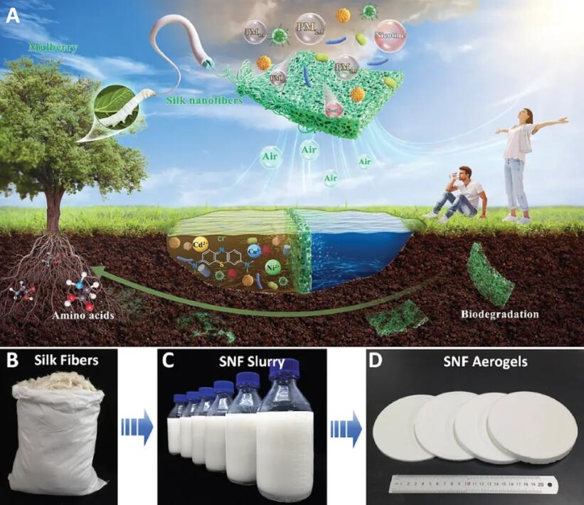

# 纳米技术及纳米机器人的应用和现状

- Source: `纳米技术及纳米机器人的应用和现状.pptx`
- Total slides: 19

## Slide 1

纳米技术及纳米机器人的应用和现状

汇报人：马锦龙

## Slide 2

目录

01

02

研究背景与发展历程

微纳操作技术应用现状

03

04

当前面临的核心问题

未来展望与深度思考

## Slide 3

01

研究背景与发展历程

## Slide 4

微纳技术三大发展阶段

20世纪60-90年代初

21世纪10年代至今

20世纪90年代-21世纪初

理论萌芽与静态操控阶段

智能融合与多功能集成阶段

结构成型与主动驱动阶段

1959年费曼提出微观机械构想，开启微纳尺度工程研究先河

微纳3D打印、异质材料一体化加工等先进工艺突破

高精度光刻、微蚀刻、激光微加工等工艺日趋成熟

机器视觉与智能算法融入，赋予机器人环境感知能力

柔性机构设计理念首次落地，规避刚性结构的作业冲击问题

精密制造仅能完成微米级简易结构加工，工艺精度不足

压电、静电等精密驱动技术实现纳米级位移分辨率

石墨烯、智能水凝胶等功能纳米材料成为核心赋能载体

作业依赖人工辅助与显微设备，属于被动式操控范畴

## Slide 5

国内外研究现状对比

国内研究特色

工程化适配强

突破微构件残余应力控制、批量加工一致性等行业难题

国外研究优势

装备自研能力突出

国产微纳加工装备实现纳米级表面精度控制

基础理论深厚

场景化应用迭代迅速

率先建立微纳柔顺机构核心设计理论

在智能控制、自主规划、多机协同等应用层面优势明显

原创技术密集

伪刚体模型、拓扑优化等经典方法由欧美团队提出

核心器件领先

高性能压电、磁致伸缩微驱动器件具备纳米级分辨率

共性技术瓶颈

材料-结构-驱动协同设计体系不完善

柔性微机构承载能力与稳定性矛盾突出

纳米材料成型一致性、界面结合强度偏低

## Slide 6

02

微纳操作技术应用现状

## Slide 7

机械制造领域应用

微纳加工装备探针系统开发

探针针尖纳米通道刻划建模仿真

针尖微纳加工试验验证

国外

国内

分子动力学仿真实现探针与工件原子交互过程可视化

国外试验体系完备，率先实现单原子层极限刻划

创新设计多自由度柔性执行机构，运动分辨率达纳米级

攻克高精度微驱动、微力传感、姿态调控等核心技术

多尺度耦合仿真兼顾微观原子变形与宏观应力场计算

国内试验聚焦工程痛点，优化工艺参数组合

率先实现高精度微纳运动控制技术突破

实现关键技术的自主可控突破

现存问题：仿真模型基于理想工况假设，与试验偏差较大

行业痛点：试验数据标准化程度低，统一工艺标准缺失

现存短板

高端传感芯片、核心探针部件部分依赖进口

## Slide 8

柔性机构与精密驱动应用

仿真技术突破

微牛顿级

国外

国内

毫米级

纳米级

攻克几何、材料、接触非线性仿真难题

引入加工残余应力、装配误差、环境扰动等实际干扰因素

运动行程

定位精度

力控精度

构建"力-电-热-结构"协同仿真体系

精准预判设备定位偏差

系统结构开发

现存问题

国外

国内

仿真模型与真实服役工况适配性不足

从单自由度柔性铰链迭代至多自由度并联

自主研发复合型柔性铰链、对称式柔性导向

高端核心部件国产化稳定性欠缺

复合柔性构型

多维并联柔性平台

多自由度耦合驱动误差难以消除

## Slide 9

纳米材料技术应用

多尺度建模仿真

技术瓶颈

分子动力学仿真精准解析材料拉伸、弯曲、界面脱粘等微观机理

从单一材料线弹性仿真迭代至多材料、多场耦合多尺度仿真体系

高端纳米薄膜制备工艺、复杂异形结构成型精度不足

四大应用体系

极端工况下材料性能衰减明显

结构增强

功能驱动

界面改性

精准传感

提升柔性构件抗疲劳性能与形变稳定性

纳米压电、MXene驱动传感一体化单元

优化涂层工艺降低微尺度磨损

实现驱动、感知、操作一体化

国内外对比

纳米材料微观结构示意图

国外

国内

高端定制化技术优势显著，极限性能领先

工程化、产业化落地优势突出，性价比高

分子动力学仿真场景：原子级材料拉伸与界面脱粘机理可视化

## Slide 10

03

当前面临的核心问题

## Slide 11

纳米复合材料与半导体加工难题

半导体加工难题

纳米复合材料问题

物理瓶颈

量子隧穿效应导致芯片严重漏电和发热

分散困难

设备局限

纳米颗粒表面能极高，在熔融基体中极易团聚

ASML极紫外光刻机售价数亿美元，极度耗电

团聚后果

良率挑战

结块处变成材料最脆弱的"断裂点"，强度不升反降

微纳米级灰尘即可导致整片晶圆报废

回收难题

纳米颗粒与基体极难分离，大多只能降级使用或焚烧

纳米级尺度下的物理极限与工程成本双重约束

两大领域均面临

## Slide 12

纳米涂层与纺织领域问题

高性能纳米涂料（建材/船舶）

耐久性差

环境侵蚀

维护成本高

纳米涂层仅几十至几百纳米厚，物理强度先天不足

大风沙尘刮擦、酸雨腐蚀、紫外线照射迅速破坏微观结构

汽车纳米隐形车衣或玻璃自清洁涂层1-2年后局部失效

纺织服装业

结合不牢

洗涤流失

环境风险

健康隐患

纳米颗粒"粘"在纤维表面而非长在内部

洗衣机搅拌和洗衣粉化学作用下大量脱落

纳米银进入污水系统，杀死有益细菌，破坏生态平衡

极微小纳米颗粒可能通过皮肤毛孔进入人体循环

## Slide 13

机械加工与医疗领域挑战

机械加工刀具

医疗领域纳米机器人核心问题

动力供应

传统电池无法缩放至纳米体积，外部驱动信号在深层组织衰减

流体阻力

低雷诺数环境下，血液黏稠度如同厚重蜂蜜

高温失效

界面剥离

靶向识别

- 切削温度突破
- 1000°C时，纳米结构发生再结晶或退火

纳米涂层与硬质合金刀基体交界处产生巨大剪切应力

生物安全

免疫系统清除、材料毒性、代谢难题未解

通信反馈

无法安装天线或传感器，只能"半盲操"

## Slide 14

三大行业痛点总结

检测极其困难

生产不便宜

实时检测难

微观完美，宏观脆弱

- 工厂流水线很难实时检测几纳米厚
- 的涂层是否均匀

需要极高纯度的原料

纳米尺度下完美的物理特性，在复杂宏观环境中极易失效

昂贵的真空、精密控制设备

质控成本高昂

通常只能抽检或等出厂后发现次品

## Slide 15

04

未来展望与深度思考

## Slide 16

纳米技术的核心价值

当材料被浓缩至纳米尺度，量子效应占据主导

展现出宏观状态下完全不具备的独特性质

已实现的产业化应用

智能手机芯片

汽车轻量化纳米复合材料

高楼大厦自清洁涂层

防臭抗菌衣物面料

核心价值体现

结构与性能的飞跃

多学科深度交叉

极高强度、极强催化活性、优异导电或隔热性能

物理、化学、生物学、微电子学和材料科学的交汇点

## Slide 17

未来三大颠覆性领域

医疗领域的"精准革命"

能源与环境的"绿色解药"

信息技术与人机融合

超越摩尔定律

智能靶向给药

下一代高效能源

基于二维纳米材料的光子芯片或量子芯片

识别特定癌细胞标志物，实现"零副作用"治愈癌症

太阳能电池光电转换效率突破现有极限

微观脑机接口

体内实时监测

分子级环境治理

纳米电极穿过血脑屏障，实现高分辨率神经信号读写

纳米传感器网络在疾病发生前数月甚至数秒内发出预警

纳米催化剂分解塑料微粒、吸附重金属、捕集二氧化碳

人工器官与组织工程

纳米级3D打印完美模拟人体细胞外基质

## Slide 18

深度思考：风险与治理

深度思考：风险与治理

科学层面

社会与伦理层面

微观完美与宏观脆弱的平衡：实验室表现惊艳，复杂现实中易失效

技术"平权"问题：纳米医疗可能固化阶级鸿沟，导致"超人类"与普通人的分裂

长期稳定性与高性价比量产是必须跨越的鸿沟

安全与武器化风险：纳米技术用于制造隐蔽性极强的生物/化学武器

环境与健康层面

发展路径

纳米毒理学缺失：对新型纳米颗粒在自然界循环、食物链富集、人体内长期滞留的毒理机制知之甚少

同步建立严密的纳米安全红线

完善纳米毒理学研究

新型环境污染：纳米产品普及可能对微观生态系统造成难以逆转的破坏

出台全球统一的伦理监管框架

## Slide 19

THE END

感谢聆听
